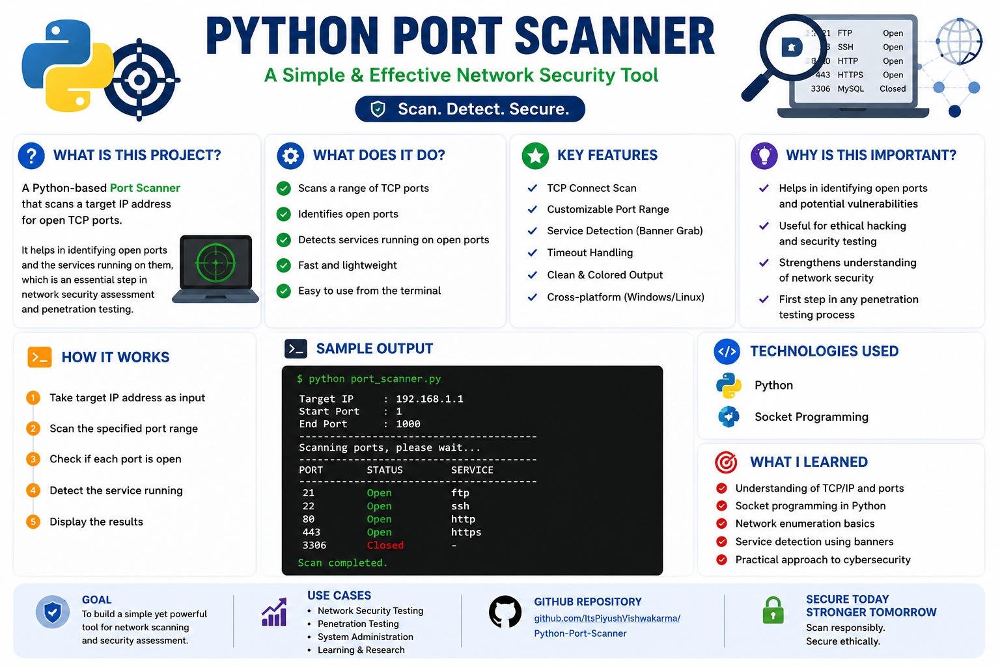
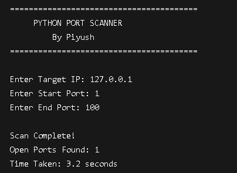

# 🔍 Python Port Scanner

A Python-based Port Scanner that scans a target host for open ports and helps identify active network services. This project demonstrates fundamental networking and cybersecurity concepts used in reconnaissance and security assessments.

---

## 📊 Project Overview



---

## 🎯 Features

- Scan common TCP ports
- Detect open ports on a target host
- Fast and lightweight Python implementation
- Displays scan results in an easy-to-read format
- Helps understand network reconnaissance techniques
- Beginner-friendly cybersecurity project

---

## 🛠 Technologies Used

- Python
- Socket Programming
- Networking Fundamentals
- TCP/IP Concepts

---

## ⚙️ How It Works

1. User enters a target IP address or hostname.
2. The program attempts to connect to specified ports.
3. Open ports are identified and displayed.
4. Results help determine which services may be running on the target system.

---

## 🖥 Sample Output



---

## 📂 Project Structure

```text
Port-Scanner/
│
├── Port_Scanner.py
├── requirements.txt
├── README.md
│
└── screenshots/
    ├── port-scanner-overview.png
    └── output.png
```

---

## 📚 Skills Learned

- Network Reconnaissance
- TCP/IP Fundamentals
- Socket Programming
- Port Scanning Concepts
- Python Networking
- Cybersecurity Basics

---

## 🔒 Common Ports Identified

| Port | Service |
|--------|---------|
| 20/21 | FTP |
| 22 | SSH |
| 23 | Telnet |
| 25 | SMTP |
| 53 | DNS |
| 80 | HTTP |
| 110 | POP3 |
| 143 | IMAP |
| 443 | HTTPS |
| 3389 | RDP |

---

## 💡 Real-World Applications

- Security Assessments
- Network Troubleshooting
- Asset Discovery
- Vulnerability Identification
- SOC and Blue Team Operations

---

## ⚠️ Disclaimer

This project was developed for educational and cybersecurity learning purposes only. Perform scans only on systems you own or have explicit permission to test.

---

## 👨‍💻 Author

**Piyush Vishwakarma**

MCA (Cybersecurity) Student

Aspiring SOC Analyst | Digital Forensics Learner | Cybersecurity Enthusiast